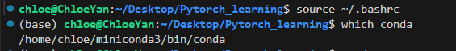
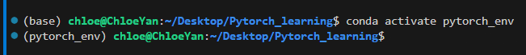
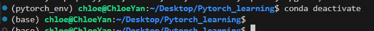
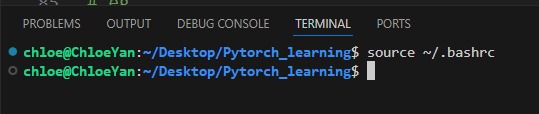
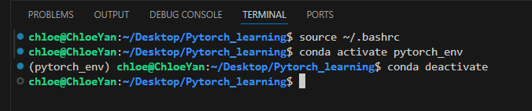

# How to active conda
首先,我并没有设置成 开启终端自动source ~/.bashrc  
所以，做所有事情之前，记得  
```bash
source ~/.bashrc
```

现在我是版本二情况

## 版本一：source ~/.bashrc 会自动进base

source之后就进(base)  

  

### 0.新建env

如果是想新建一个conda，那么下一步  
```bash
conda create -n <your_new_env_name> python=3.8
# <your_new_env_name> for example:  pytorch_env 
# py3.8 recommended

# eg.
conda create -n pytorch_env python=3.8
```

创建成功后，需要activate  
```bash
conda activate <your_new_env_name>

# eg.
conda activate pytorch_env
```

这样就会进入(env)，比如我是(pytorch_env)   




### 1.activate  
想进入已建好的pytorch_env，步骤是
```bash
source ~/.bashrc
# 此时进了(base)
conda activate pytorch_env
# 此时进了(pytorch_env)
```


### 2.deactivate
结束的时候，
```bash
conda deactivate
```
这样就回到了(base)  

  

这样是回退到(base)，但是这个(base)就别想退掉了哈，当前终端source过了，只能开一个没被source污染过的终端  


## 版本二：source ~/.bashrc 不会自动进base

source后而不会自动进base，设置如下：
```bash
conda config --set auto_activate_base false
```

  

### 0.新建env

任意地方直接新建，无需进入(base)
```bash
conda create -n <your_new_env_name> python=3.8
# <your_new_env_name> for example:  pytorch_env 
# py3.8 recommended

# eg.
conda create -n pytorch_env python=3.8
```

创建成功后，需要activate  
```bash
conda activate <your_new_env_name>

# eg.
conda activate pytorch_env
```

这样就会进入(env)，比如我是(pytorch_env)   


### 1.activate  
想进入已建好的pytorch_env，步骤是
```bash
source ~/.bashrc
# 此时尚未进入(base)
conda activate pytorch_env
# 直接进(pytorch_env)，不用(base)
```

### 2.deactivate
结束的时候，
```bash
conda deactivate
```
这样就回到了最原始的终端  




## ✅ Conda 中的 `(base)` 与自建环境如 `(pytorch_env)` 总结

### 1. 什么是 `(base)` 环境？
- Conda 安装时自动创建的默认环境。
- 包含 Conda 自身和基础软件包。
- 用于管理 Conda 工具，但不推荐在此开发项目。

### 2. 什么是自建环境 `(pytorch_env)`？
- 用户通过 `conda create` 命令创建的独立环境。
- 可以指定 Python 版本、安装项目依赖，如 PyTorch。
- 完全独立，适合隔离管理每个项目的依赖。

### 3. `(base)` 和自建环境的关系
- 都属于 Conda 管理的环境，处于同一级别。
- 彼此独立，互不影响。
- `base` 更像是系统管理员使用的基础环境，而 `pytorch_env` 是开发环境。

### 4. 是否必须进入 `(base)` 才能创建新环境？
- 不需要。
- 只要 Conda 命令可用（`conda init` + `source ~/.bashrc`），
  就可以随时创建和管理新环境，无需先激活 `base`。


## ✅ 其他提示

### 1.查看所有 Conda 环境
```bash
conda env list      # 方法1
conda info --envs   # 方法2
```
### 2.删除一个conda环境
```bash
conda remove -n my_env_name --all
```
推荐每一个项目独立一个conda环境，避免污染

### 3.导出与复现
```bash
# 导出当前环境配置：
conda env export > environment.yml

# 复现环境
conda env create -f environment.yml
```


