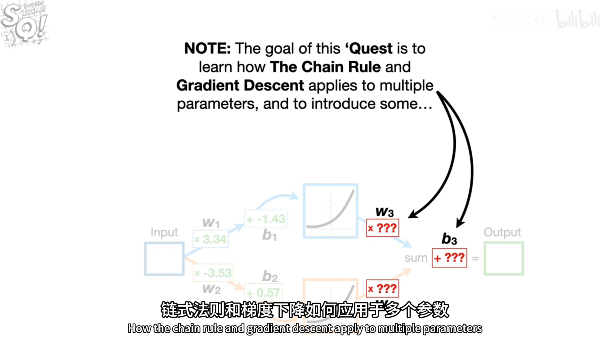
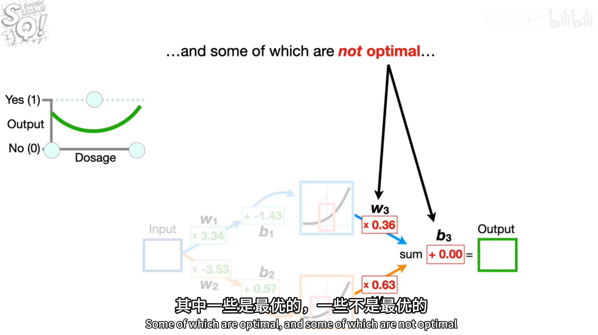
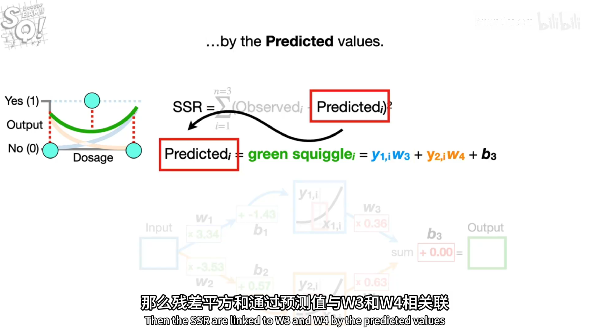
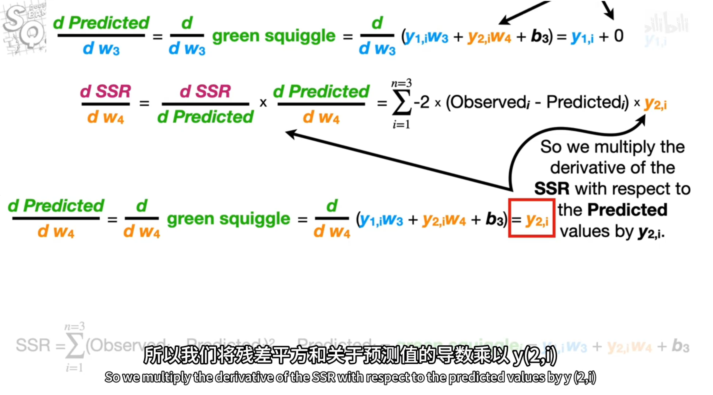
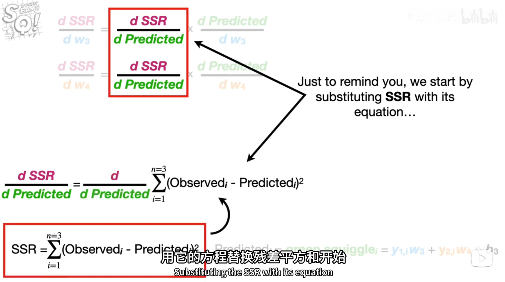
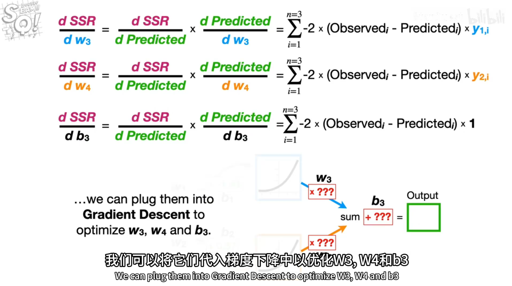

# 反向思想进阶1

## 需要优化w3、w4、b3

### 1.赋初值
绿色字表示是最优值，红色字表示并非最优值  

### 2.含参w3、w4、b3列式
predicted_i 

计算SSR  

### 3.SSR对w3、w4、b3求导
SSR对w3求偏导：系数剩y(1,i)  
SSR对w4求偏导：系数剩y(2,i)

其实SSR对w3、w4和对b3求导的结果形式是一样的

w3、w4、b3都代入梯度下降，进行优化

