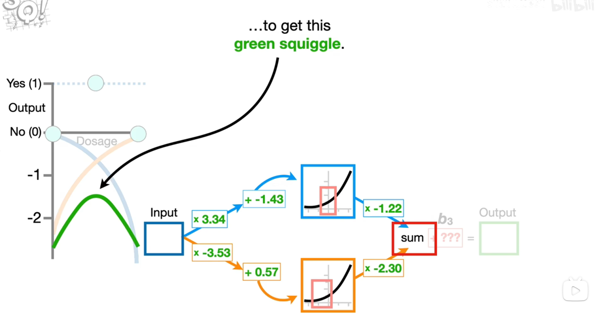
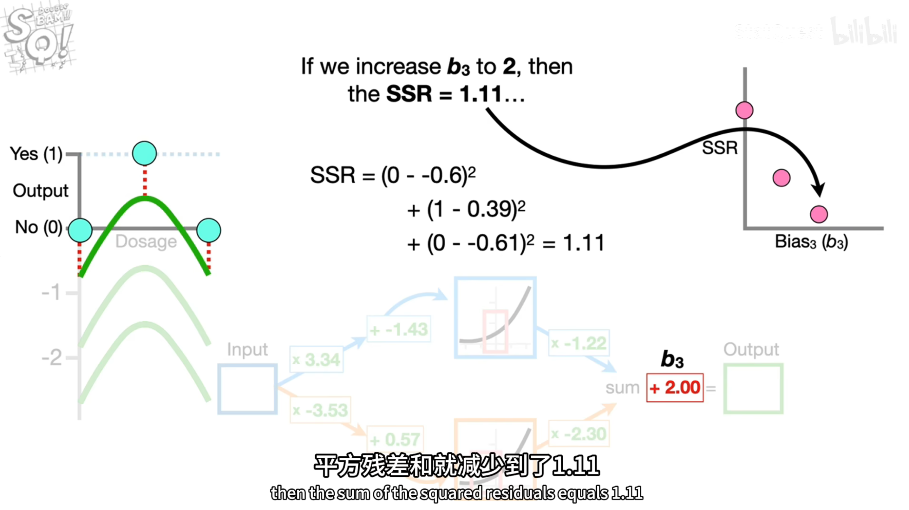
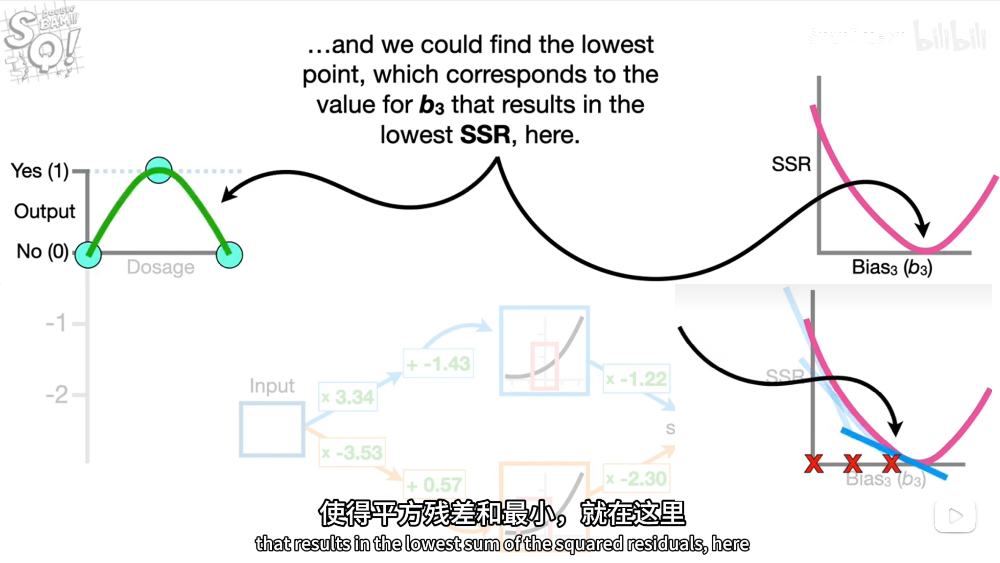
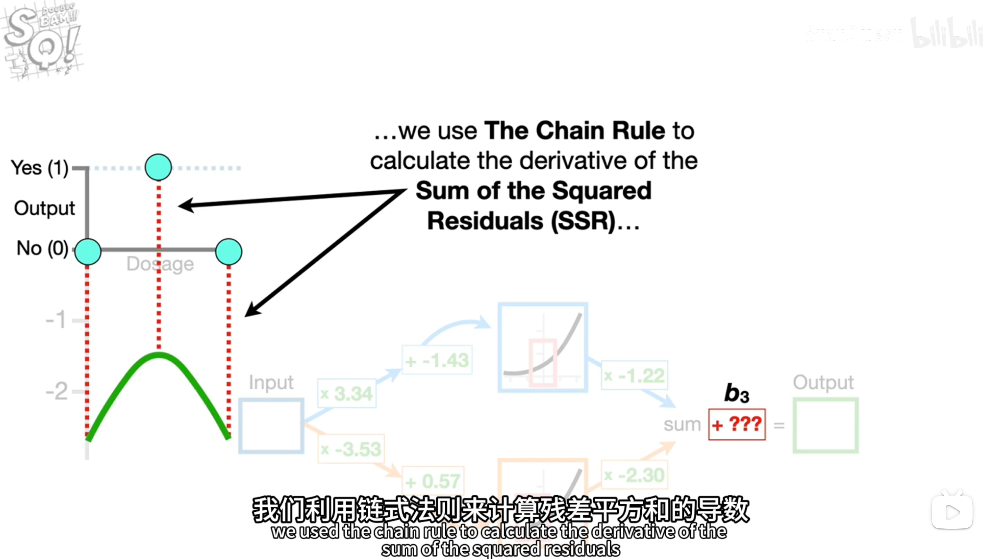

# 反向传播思想

## 1.合成绿色曲线：残差平方和
绿色曲线由蓝色和橙色曲线合成  
（暂时不考虑b3）

 

## 2.对b3赋一个值，计算残差平方和SSR
取值，试验，看看SSR是否变小

直到最小值点  

## 3.然而并非一个个试，而是可以反向解得
一句话总结：当不确定b3时，先给一个初值0.0，然后梯度下降逐步优化迭代出最优b3  
具体操作方法：SSR对b3求导，用链式法则计算残差平方和的导数，用于更新步长，梯度下降，直到e最小

