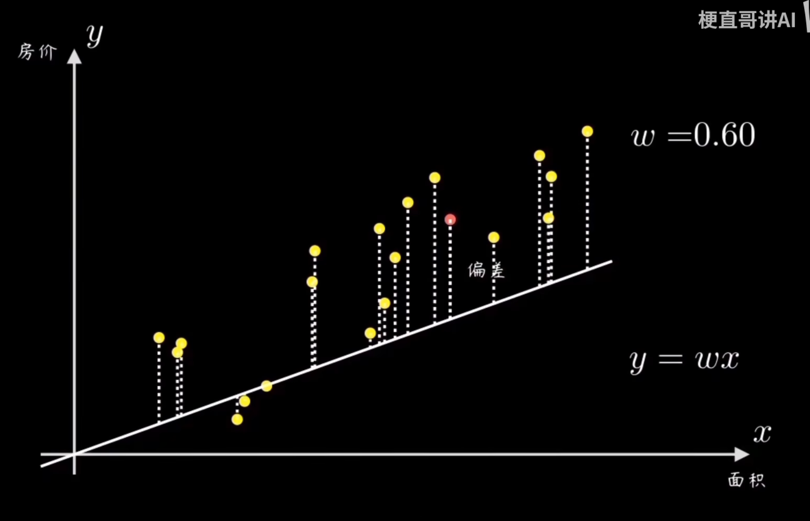
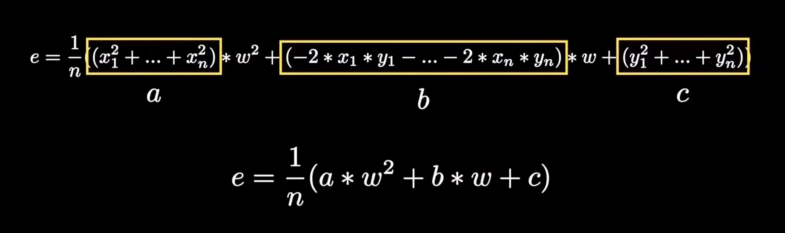
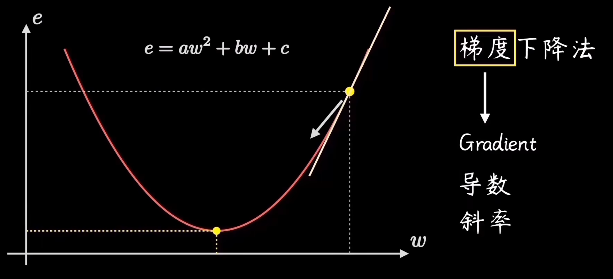
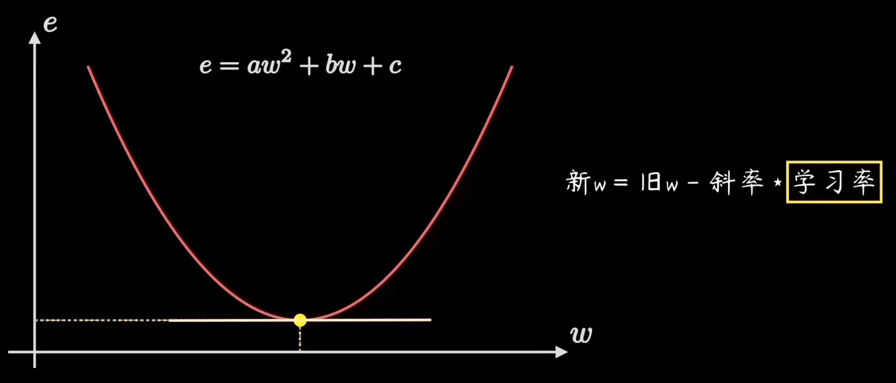
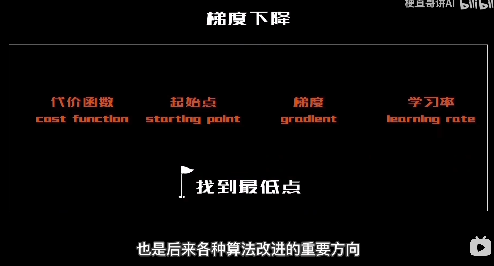
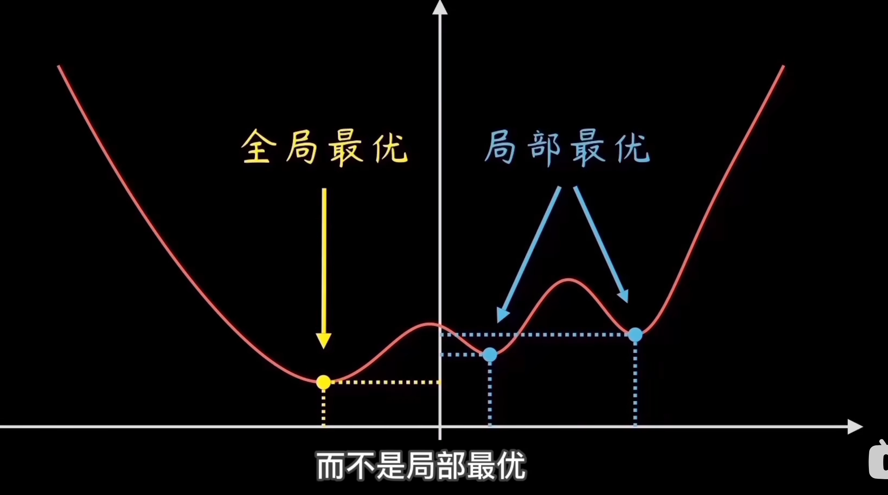
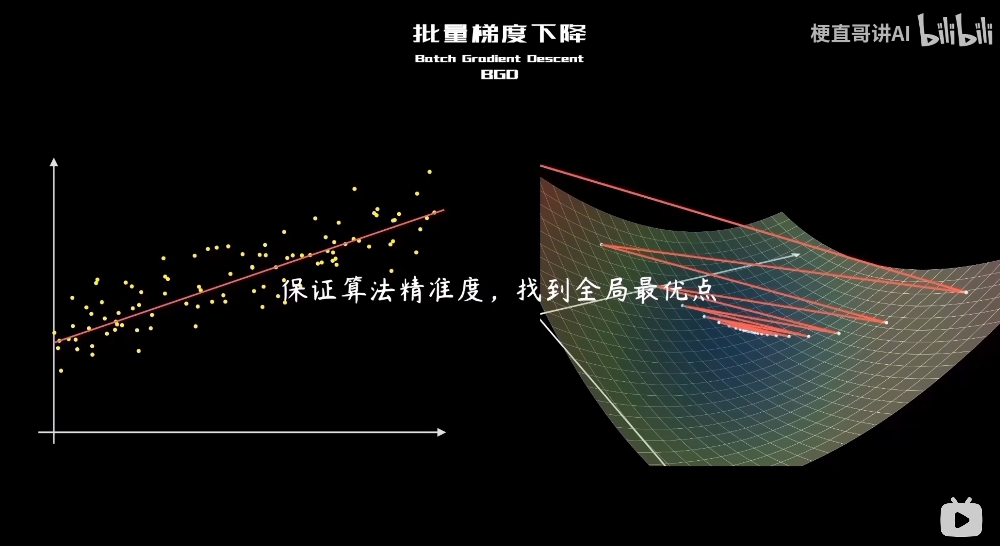
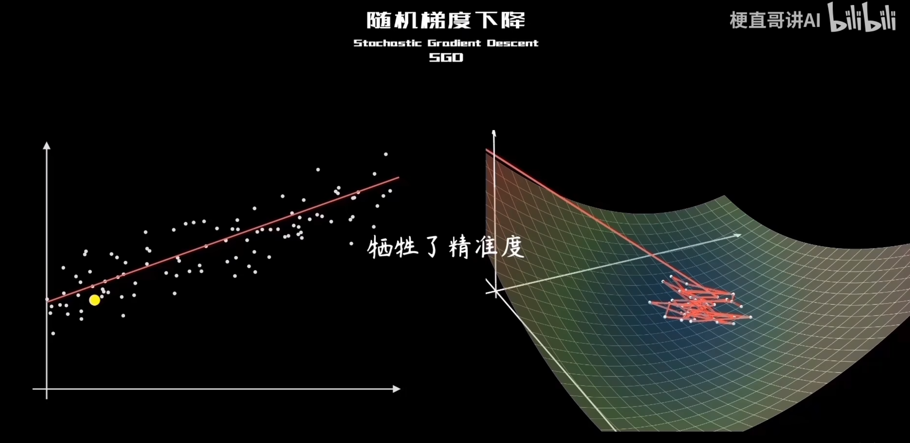
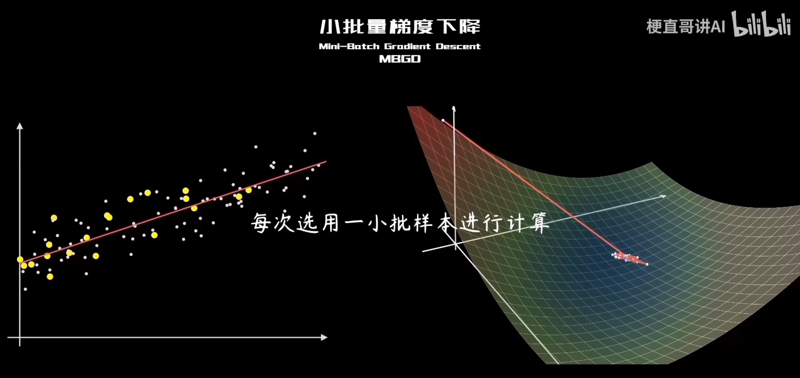
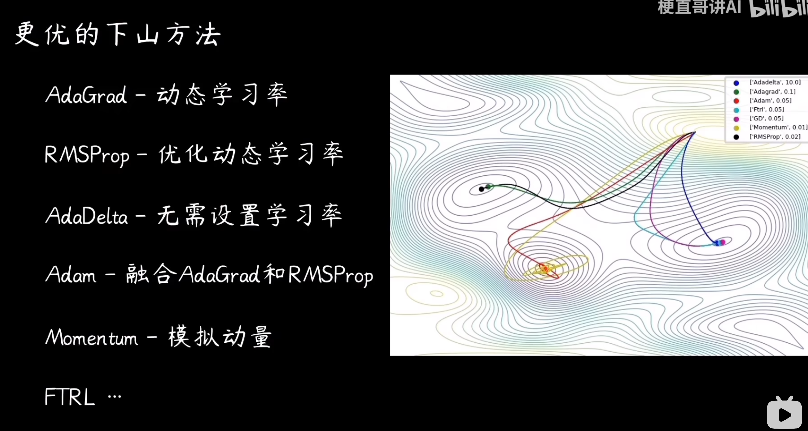

# 梯度下降算法

## 理想情况：e为抛物线
### 1.预测函数
y=wx

### 2.代价函数
量化误差：均方误差

要找到一个w值，使e最小，即抛物线最低点

### 3.沿梯度下降
计算梯度  
从任意点出发，沿着方向导数（斜率下降最快），一定最快到达最低点

### 4.学习率
即步长  
如果步长取太小，会在最低点附近震荡，无法收敛；  
如果步长等于斜率，理论上效果是，斜率大时大步长，斜率小时小步长。但是实际上会左右横跳 ，步长还是太大；  
将斜率乘以某个很小的系数，既有大步、小步的调整效果，步长又较为合理，这个最优的系数称为学习率。  

### 5.循环迭代
当步长很接近0时，认为达到最小值，将停止

### 6.关键词总结

## 现实情况：并非一元二次
当存在多个最小点时，找的是最小值点而非极小值点。  
即全局最优而非局部最优   

## 三、梯度下降三种方式对比（BGD / SGD / MBGD）

| 项目                 | BGD（Batch Gradient Descent）     | SGD（Stochastic Gradient Descent）     | MBGD（Mini-Batch Gradient Descent） |
|----------------------|-----------------------------------|----------------------------------------|-------------------------------------|
| **每次取样数据量**   | 全部样本                         | 1 个样本                               | 一小批样本（如32或64）             |
| **参数更新频率**     | 每轮 1 次                         | 每轮 n 次（n = 样本数）                | 每轮 n/batch_size 次               |
| **内存消耗**         | 高                                | 低                                     | 中                                 |
| **收敛速度**         | 慢但稳定                          | 快但震荡                               | 较快且稳定                         |
| **计算效率**         | 慢                                | 快（每步）                             | 较好（适合 GPU 并行）             |
| **收敛效果**         | 容易收敛到最优解                  | 容易跳出局部最优，但震荡大             | 兼顾收敛和震荡，实际中最常用       |

---

  

## 更优的梯度下降算法
