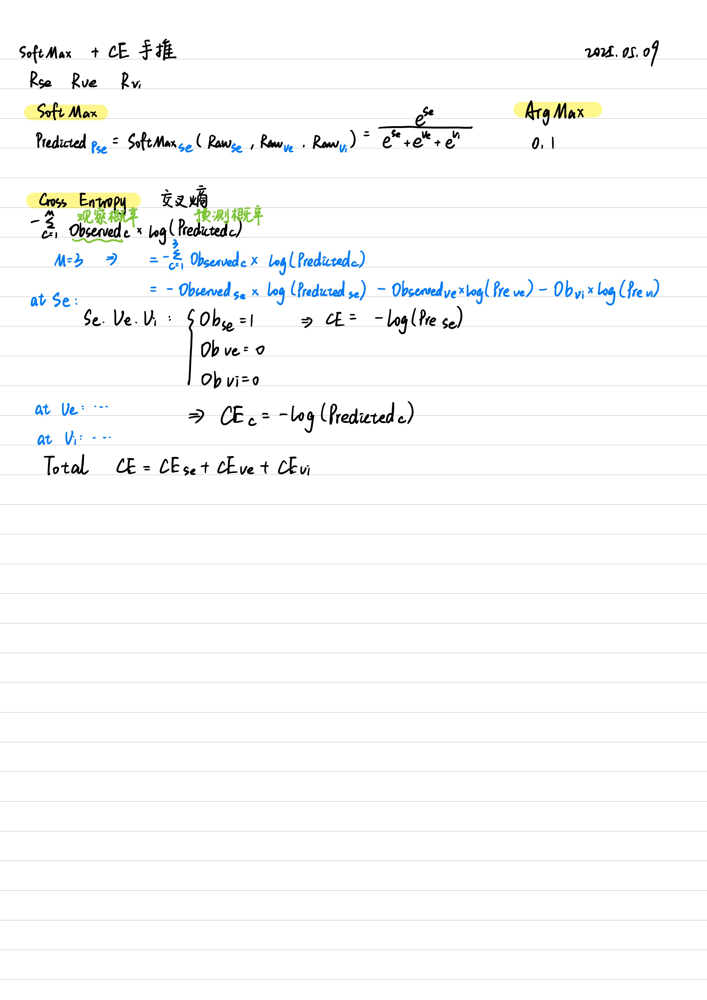
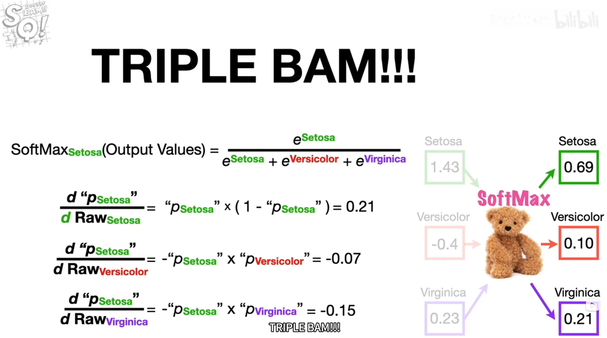
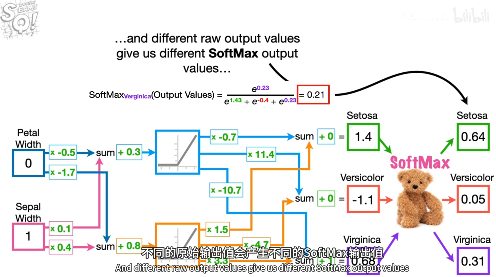
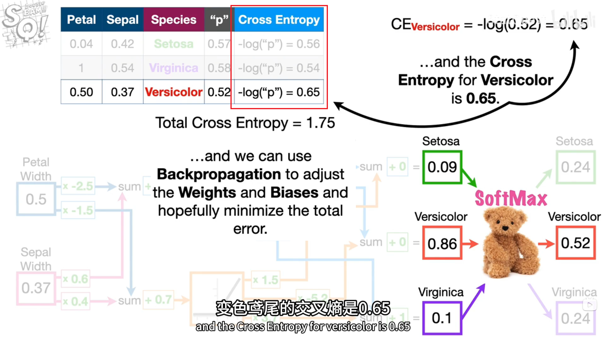
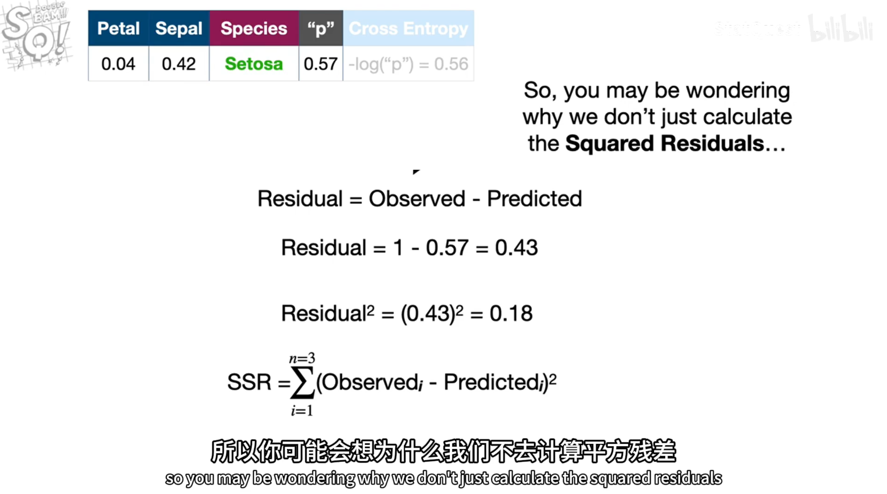
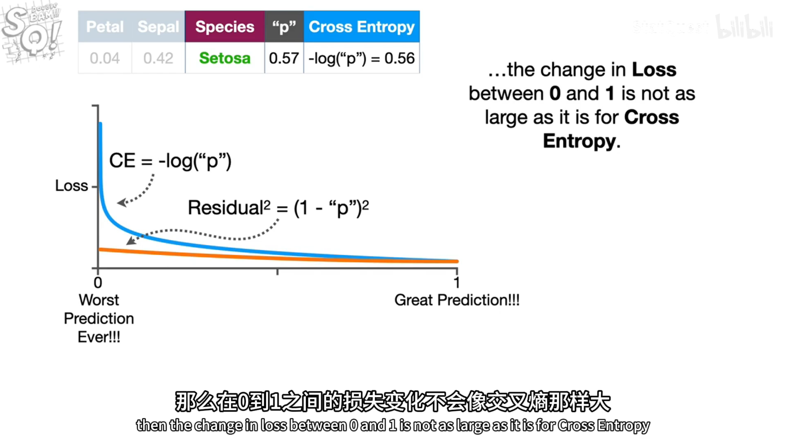
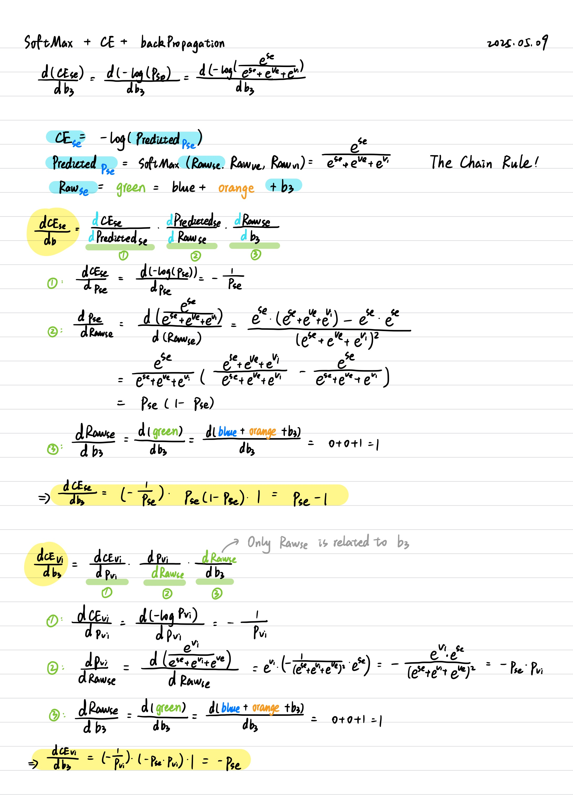

# SoftMax + CrossEntrop + BackPropagation
**softmax激活函数+交叉熵+反向传播**  

**案例：Se、Ve、Vi 三种花**  

## 1.SoftMax、ArgMax、CE
- SoftMax 数值在(0,1)
- ArgMax 数值只能取0或1
- CE=-log(p) (针对神经网络的简化版) 

从Raw到SoftMax计算结果如下：

## 2.为什么使用CE交叉熵？
- 为什么不直接使用SSR残差平方和？  
-->为了反向传播！为了梯度下降！ 

首先，CE计算结果如下：

SSR计算式如下：  

CE是-log()，在(0,1)有指数爆炸效果。  
当神经网络效果不好时，LOSS曲线斜率会非常大，能够在梯度下降时跨大步；  

而SSR的LOSS曲线，更为扁平，变化没有那么大，步幅也就不够大，不利于快速梯度下降  

## 3.CE+BackPropagation 链式法则手推

