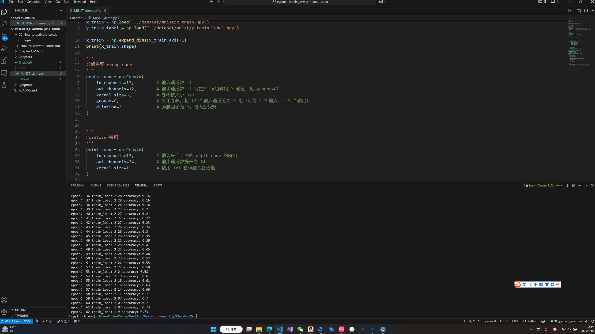

# 第2次报告 
2025.05.01-2025.05.14  
已push  https://github.com/Chloe-Yan-3465/Pytorch-Learning.git

## I.Pytorch部分

### 1.已学内容

前置：在wsl中配置了conda环境，经验文档为 00-How-to-activate-conda，我的conda配置列表放在README.md  

- **Chapter3 入门体验**  
在b站找了一个Pytorch MINST 手写识别的开源，使用的是

- **Chapter4 基础算法**   
    - 链式法则：
        - 即求导
        - 补充了一元线性回归中的使用的链式法则,笔记：Chapter4/Chain_Rule   
    - 梯度下降：  
        - 关键词：方向导数、梯度，学习率。  
        - 沿梯度方向可最快到达最低点，新w=旧w-斜率*学习率
        - 笔记：Chapter4/Grandient_Descent  
    - 反向传播
        - 省流：先设置一个初始值，然后梯度下降迭代优化，直到满足停止条件，获得最优值  
        - 笔记：  
        核心思想：只优化b3：Chapter4/Backpropagation/backpropagation_main_ideas.md  
        进阶版1：优化w3+w4+b3：Chapter4/Backpropagation/backpropagation_detailed_P1.md 
    - ReLU激活函数  
        - 也称整流函数
        - 笔记：Chapter4/ReLU_activation_function

- **Chapter5 卷积**  
    - 卷积：  
        - 滑动窗口、加权求和
    - SoftMax、CE、Backpropagation
        - SoftMax算得概率
        - CE比SSR的优点是，LOSS曲线在(0,1)上趋于0时有指数爆炸，利于梯度下降的大跨步  
        - 反向传播 关键点在于链式法则求导 
    - 深度可分离卷积
        - step1：逐通道卷积 Depthwise Convolution
        - step2：逐点卷积 Pointwise Convolution
    - 膨胀卷积
        - 扩大模型视野    
    - 卷积版本的MINST手写识别  

    - 